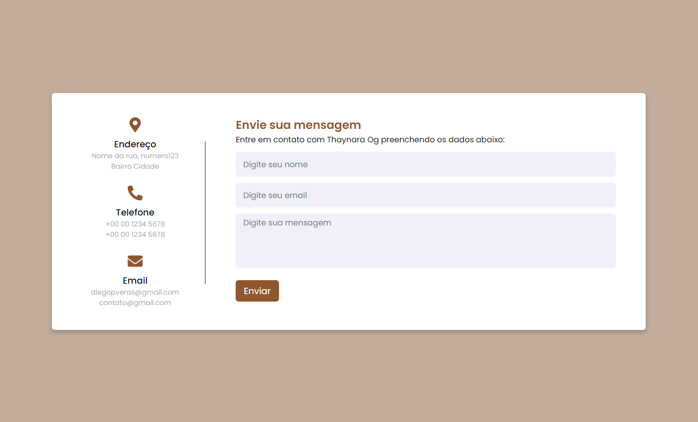
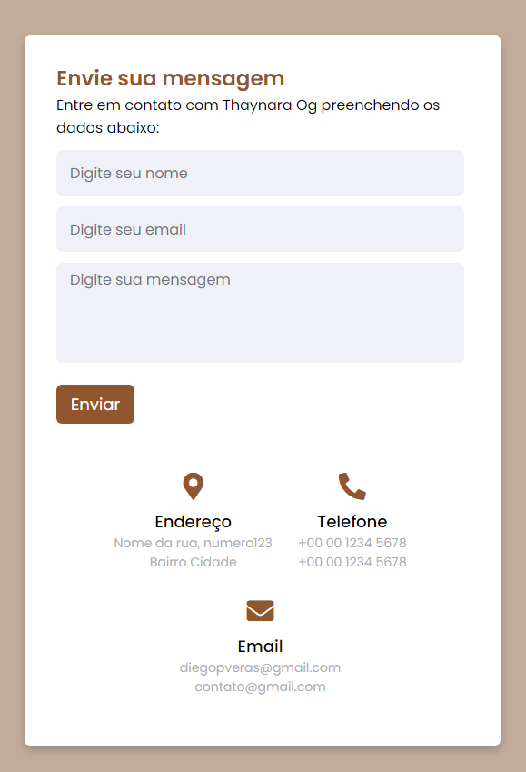

# Desafio Formulário - Histórico

## Formulário de contato Thaynara OG

- Criação do formulário de contato da Taynara Og no Frontend por meio de HTML e CSS
- Desenvolvi a backend que recolhe os dados e monta um body para fazer a requisição e salvar os dados
- Além disso tentei utilizar o Nodemailer para enviar o email de confirmação ao usuário usando Twillio
- Após o desenvolvimento do backend, criei o banco de dados para registro das informações enviadas pelo formulário

Tecnologias utilizadas
- HTML, CSS, Javascript Libs: json-server, nodemailer

# Image do formulário na web

# Image do formulário responsiva para mobile

